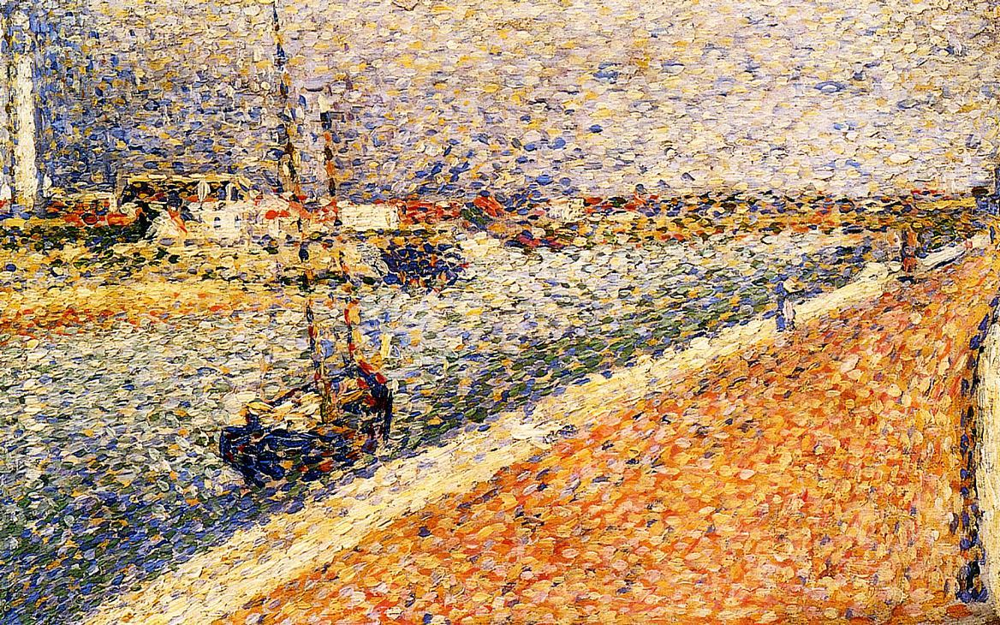
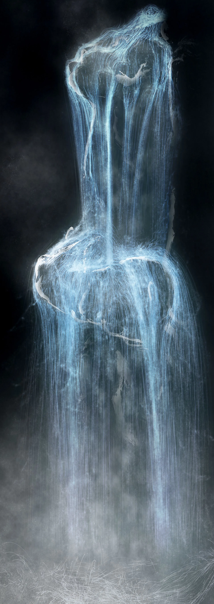

# hpan0072_9103_tut4
This is my Quiz8 assignment
## Part 1: Imaging Technique Inspiration
I love teamLab's interactive digital artworks, Their work *“Universe of Water Particles”* transforms fluid dynamics into art, with **particles** simulating the physical movement of water. I hope that this technique can be used to recreate *“Saint-Georges majeur au crépuscule”*. It is interesting to simulate the natural scenes of the Impressionist paintings with the organic feeling of particle flow just like the **pointillism**. I also wanted to link the visual elements with sound to add a sense of dynamism to the work.
- Pointillism image

- Universe of Water Particles

## Part 2: Coding Technique Exploration
1. I intend to use the **p5.js particle system library** to transform the sky, water reflections, and sunsets into dynamic particle-based representations, and to use **Perlin noise** to achieve dynamic effects while maintaining a certain level of uniformity.
2. **p5.sound library** analyzes the frequency and amplitude of the audio, and by connecting the audio frequencies to particle motion and colour changes, dynamic animation effects can be created. For example, high frequencies can cause particles in the sky to shimmer, while low frequencies can affect the dynamics of water waves.
- Sample code and demo:
[Perlin noise](miguelrr11.github.io/Noise_Flow_Field/)
[Particle effect](https://editor.p5js.org/Playful-Coding/sketches/XbeqeA_XT)
[Sound system](https://editor.p5js.org/Guarco1/sketches/HyBHvI27W)

